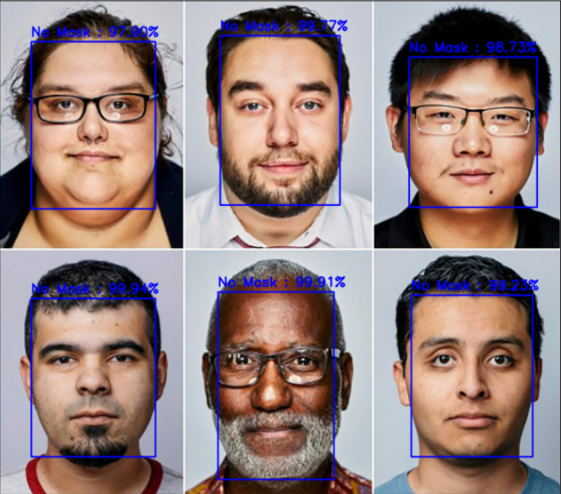
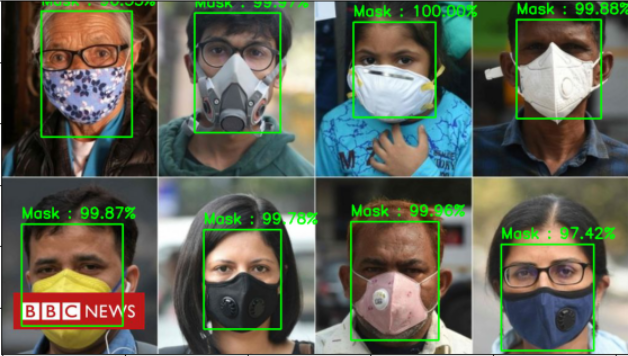

# Read-Time-Face-Mask-Detecting-System

Read Time Face Mask Detecting System using OpenCV, Keras/TensorFlow, and Deep Learning. 

Easily detects whether you are wearing a Face Mask or not. Binary Classification was performed using a CNN Model giving highly accurate results .The Deep Learning model was built using the Pre-Trained Xception model (All Layers Freezed during training) who's output was given to  Fully Connected Dense layers trained using Dataset for Binary Classification between Masked and Un-masked Human Faces.

Real-time detection of Masked/Un-masked faces is done using OpenCV and Python. The detected area having a confidence value above 50% was given to the Fully Connected CNN for Classification. Need some more fine-tuning in Masked Face Detection as the artificially generated data was less.

## Getting Started

### Dependencies

* Jupyter Notebook required

* Python Libraries

    - Imutils
    - Tensorflow
    - Keras
    - Numpy
    - Pickle
    - cv2
    - os
    - Scikit-Learn
    - Matplotlib

### Installing

* Download Jupyter Notebook

* No further installation

### Executing program

There are 3 phases of this program, run each of them.

* Train a Deep Convolutional Neural Network to distinguish between Masked and Non-Masked faces

* Recognize faces with OpenCV in Video Streams

* Classify the faces using the trained model

## Help

Installing the libraries beforehand will solve most issues

## Authors

Contributors names and contact info 
ex. [@priyanshkedia04](https://github.com/priyanshkedia04)

## Version History

* 0.1
    * Initial Release

## License

GNU General Public License v3.0
